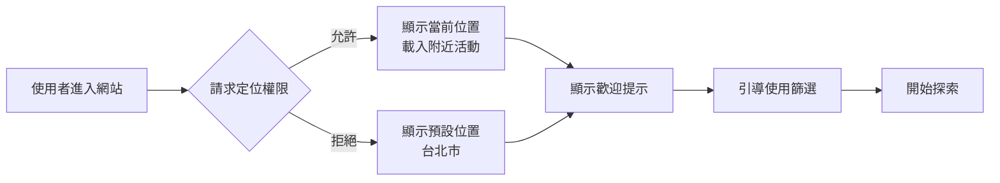
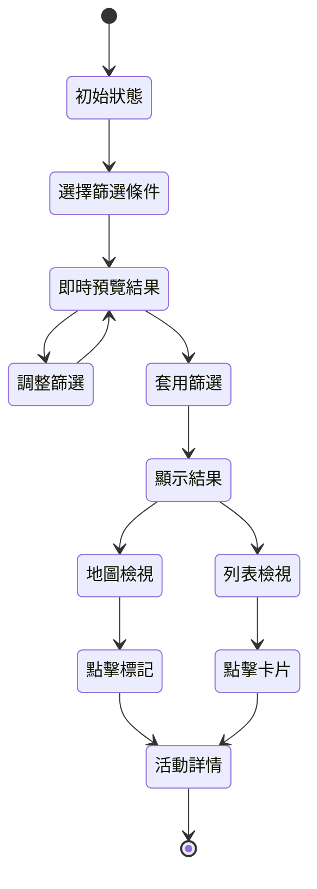
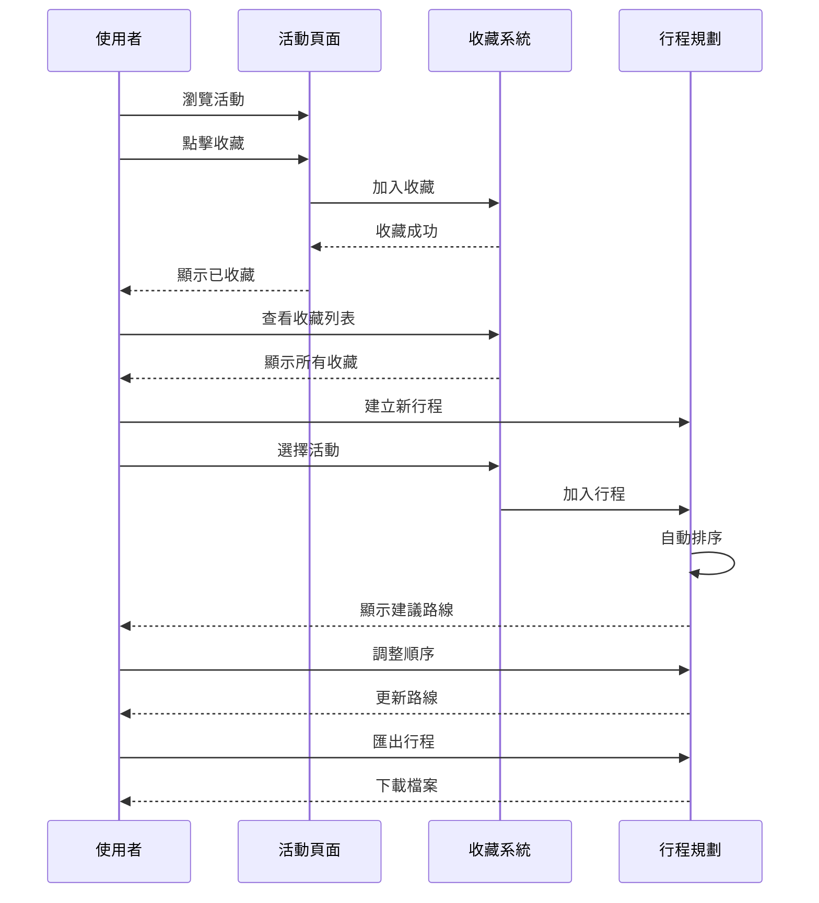

# 使用者介面與互動流程設計

## 1. 使用者介面架構

### 1.1 頁面結構

```
觀光活動地圖
├── 首頁（地圖檢視）
│   ├── 地圖區域
│   ├── 篩選面板
│   ├── 活動列表（可切換）
│   └── 快速搜尋列
├── 活動詳情頁
│   ├── 活動資訊
│   ├── 地圖定位
│   ├── 相關活動
│   └── 分享功能
├── 我的收藏
│   ├── 收藏列表
│   ├── 行程規劃
│   └── 匯出功能
└── 搜尋結果頁
    ├── 結果列表
    ├── 篩選調整
    └── 地圖檢視
```

## 2. 主要頁面設計

### 2.1 首頁 - 地圖檢視

```
┌─────────────────────────────────────────────────────────────┐
│ [Logo] 台灣觀光活動地圖        [當週活動] [我的收藏] [選單] │
├─────────────────────────────────────────────────────────────┤
│ ┌───────────────────┬─────────────────────────────────────┐ │
│ │                   │                                     │ │
│ │   篩選條件        │         Google Maps 地圖區域        │ │
│ │                   │                                     │ │
│ │ 活動類型：        │      [目前位置標記]                │ │
│ │ □ 傳統節慶       │                                     │ │
│ │ □ 浪漫之旅       │    📍 📍 📍  [活動標記]           │ │
│ │ □ 藝術文化       │         📍                         │ │
│ │ □ 養生樂活       │      📍    📍                      │ │
│ │ □ 美食饗宴       │                                     │ │
│ │ □ 自然生態       │  ┌─────────────────┐               │ │
│ │ □ 原民慶典       │  │ 活動摘要彈出窗  │               │ │
│ │ □ 客家文化       │  │ 2025台灣燈會    │               │ │
│ │                   │  │ 📅 2/1-2/15     │               │ │
│ │ 日期範圍：        │  │ 📍 台北市       │               │ │
│ │ [開始] - [結束]   │  │ [查看詳情]      │               │ │
│ │                   │  └─────────────────┘               │ │
│ │ 地區：            │                                     │ │
│ │ ○ 全部           │  [−] 縮小  [+] 放大                │ │
│ │ ○ 北部地區       │  [🧭] 定位  [📍] 圖層              │ │
│ │ ○ 中部地區       │                                     │ │
│ │ ○ 南部地區       ├─────────────────────────────────────┤ │
│ │ ○ 東部地區       │ [地圖檢視] [列表檢視]   共 25 個活動│ │
│ │ ○ 離島地區       └─────────────────────────────────────┘ │
│ │                                                           │ │
│ │ [套用篩選]                                                │ │
│ └───────────────────┘                                       │ │
└─────────────────────────────────────────────────────────────┘
```

### 2.2 活動列表檢視

```
┌─────────────────────────────────────────────────────────────┐
│ 搜尋結果：找到 25 個活動              排序：[距離最近 ▼]    │
├─────────────────────────────────────────────────────────────┤
│ ┌─────────────────────────────────────────────────────────┐ │
│ │ 🎭 2025 台灣燈會                              ⭐ 收藏   │ │
│ │ 📅 2025/02/01 - 2025/02/15                             │ │
│ │ 📍 台北市信義區市府廣場                   🚶 2.5 km   │ │
│ │ 全台最大規模燈會活動，展現台灣傳統與現代藝術...       │ │
│ │ 標籤：#傳統節慶 #藝術文化                              │ │
│ └─────────────────────────────────────────────────────────┘ │
│                                                              │
│ ┌─────────────────────────────────────────────────────────┐ │
│ │ 🌸 陽明山花季                                ⭐ 收藏   │ │
│ │ 📅 2025/02/15 - 2025/03/20                             │ │
│ │ 📍 台北市北投區陽明山國家公園             🚗 15 km   │ │
│ │ 春天賞花好去處，櫻花、杜鵑花盛開...                   │ │
│ │ 標籤：#自然生態 #浪漫之旅                              │ │
│ └─────────────────────────────────────────────────────────┘ │
│                                                              │
│ ┌─────────────────────────────────────────────────────────┐ │
│ │ 🍜 大稻埕年貨大街                            ⭐ 收藏   │ │
│ │ 📅 2025/01/15 - 2025/01/29                             │ │
│ │ 📍 台北市大同區迪化街                     🚶 3.8 km   │ │
│ │ 傳統年貨採買，品嚐道地美食小吃...                     │ │
│ │ 標籤：#美食饗宴 #傳統節慶                              │ │
│ └─────────────────────────────────────────────────────────┘ │
│                                                              │
│                    [載入更多活動]                            │
└─────────────────────────────────────────────────────────────┘
```

### 2.3 活動詳情頁

```
┌─────────────────────────────────────────────────────────────┐
│ [< 返回]            2025 台灣燈會              [分享] [收藏]│
├─────────────────────────────────────────────────────────────┤
│ ┌─────────────────────────────────────────────────────────┐ │
│ │                    [活動主視覺圖片]                       │ │
│ │                                                           │ │
│ └─────────────────────────────────────────────────────────┘ │
│                                                              │
│ 📅 活動時間                                                 │
│ 2025年2月1日 - 2025年2月15日                               │
│ 每日 18:00 - 22:00                                         │
│                                                              │
│ 📍 活動地點                                                 │
│ 台北市信義區市府路1號（市府廣場）                          │
│ [查看地圖] [規劃路線]                                       │
│                                                              │
│ ┌─────────────────────────────────────────────────────────┐ │
│ │              [嵌入式 Google Maps]                        │ │
│ │                                                           │ │
│ │                    📍                                    │ │
│ │                                                           │ │
│ └─────────────────────────────────────────────────────────┘ │
│                                                              │
│ 📝 活動介紹                                                 │
│ 2025台灣燈會以「光耀台灣」為主題，結合傳統花燈工藝與     │
│ 現代科技藝術，打造全台最大規模的燈會盛事。活動期間將     │
│ 展出超過100組大型花燈作品，並有精彩的表演活動...         │
│                                                              │
│ 🎫 參加資訊                                                 │
│ • 免費入場                                                  │
│ • 建議搭乘大眾運輸工具                                     │
│ • 現場提供導覽服務                                         │
│                                                              │
│ 📞 聯絡資訊                                                 │
│ 電話：02-2720-8889                                         │
│ 網站：www.taiwanlantern.tw                                 │
│                                                              │
│ 🏷️ 活動標籤                                                │
│ [傳統節慶] [藝術文化] [親子活動] [夜間活動]               │
│                                                              │
│ ─────────────────────────────────────────────────────────  │
│ 🗓️ 相關活動推薦                                            │
│                                                              │
│ • 平溪天燈節 - 2/8, 新北市平溪區                          │
│ • 鹽水蜂炮 - 2/9-2/10, 台南市鹽水區                       │
│ • 台東炸寒單 - 2/9, 台東市                                │
└─────────────────────────────────────────────────────────────┘
```

## 3. UI 元件設計規範

### 3.1 色彩系統

```css
:root {
  /* 主要色彩 */
  --primary-color: #2563EB;      /* 主色 - 藍色 */
  --secondary-color: #10B981;    /* 輔助色 - 綠色 */
  --accent-color: #F59E0B;       /* 強調色 - 橘色 */
  
  /* 中性色 */
  --gray-900: #111827;           /* 主要文字 */
  --gray-700: #374151;           /* 次要文字 */
  --gray-500: #6B7280;           /* 輔助文字 */
  --gray-300: #D1D5DB;           /* 邊框 */
  --gray-100: #F3F4F6;           /* 背景 */
  
  /* 活動類別色彩 */
  --category-traditional: #DC2626;    /* 傳統節慶 - 紅 */
  --category-romantic: #EC4899;       /* 浪漫之旅 - 粉 */
  --category-art: #7C3AED;           /* 藝術文化 - 紫 */
  --category-wellness: #10B981;      /* 養生樂活 - 綠 */
  --category-cuisine: #F59E0B;       /* 美食饗宴 - 橘 */
  --category-nature: #059669;        /* 自然生態 - 深綠 */
  --category-indigenous: #B91C1C;    /* 原民慶典 - 深紅 */
  --category-hakka: #1E40AF;         /* 客家文化 - 深藍 */
}
```

### 3.2 元件樣式

#### 按鈕元件
```
主要按鈕 (Primary Button)
┌─────────────────┐
│   套用篩選      │  背景: --primary-color
└─────────────────┘  文字: white

次要按鈕 (Secondary Button)  
┌─────────────────┐
│   查看詳情      │  背景: white
└─────────────────┘  邊框: --gray-300
                     文字: --gray-700

圖標按鈕 (Icon Button)
┌───┐
│ ⭐ │  大小: 40x40px
└───┘  圓角: 50%
```

#### 卡片元件
```
活動卡片 (Activity Card)
┌─────────────────────────────┐
│ [縮圖]  標題               │  陰影: 0 1px 3px rgba(0,0,0,0.1)
│         時間 | 地點        │  圓角: 8px
│         簡短描述...        │  內距: 16px
│         [標籤] [標籤]      │  
└─────────────────────────────┘
```

### 3.3 響應式設計斷點

```css
/* 手機 */
@media (max-width: 640px) {
  /* 單欄佈局 */
  /* 隱藏側邊篩選，改為浮動按鈕 */
  /* 地圖全螢幕，列表在下方 */
}

/* 平板 */
@media (min-width: 641px) and (max-width: 1024px) {
  /* 兩欄佈局 */
  /* 側邊篩選可收合 */
  /* 地圖與列表可切換 */
}

/* 桌面 */
@media (min-width: 1025px) {
  /* 三欄佈局 */
  /* 完整側邊篩選 */
  /* 地圖與列表同時顯示 */
}
```

## 4. 互動流程設計

### 4.1 首次使用流程



### 4.2 搜尋與篩選流程



### 4.3 收藏與行程規劃流程



## 5. 手機版特殊設計

### 5.1 手機版佈局

```
┌─────────────────────┐
│ 🍔 □□□ 觀光地圖    │  固定頂部導航
├─────────────────────┤
│                     │
│   Google Maps       │  地圖佔 60% 高度
│                     │
│     📍  📍         │
│        📍          │
├─────────────────────┤
│ ▲ 附近 15 個活動   │  可上拉展開
├─────────────────────┤
│ 2025 台灣燈會      │
│ 📅 2/1-2/15 🚶2km │  活動列表
├─────────────────────┤
│ 陽明山花季         │
│ 📅 2/15-3/20 🚗15km│
└─────────────────────┘

浮動按鈕：
  [篩選] - 右下角
  [定位] - 右下角上方
```

### 5.2 手勢操作

- **上滑**：展開活動列表
- **下滑**：收合活動列表
- **左右滑動**：切換活動卡片（列表模式）
- **雙指縮放**：地圖縮放
- **長按地圖**：顯示該點附近活動

## 6. 無障礙設計

### 6.1 視覺無障礙
- 所有色彩對比度符合 WCAG AA 標準
- 提供高對比模式選項
- 圖標配合文字標籤

### 6.2 操作無障礙
- 支援鍵盤完整操作
- 提供跳過導航功能
- 表單具有清楚標籤

### 6.3 螢幕閱讀器支援
- 所有互動元素具有 ARIA 標籤
- 動態內容更新時提供通知
- 圖片提供替代文字

## 7. 效能優化考量

### 7.1 載入優化
- 漸進式載入地圖標記
- 圖片延遲載入
- 虛擬滾動列表

### 7.2 互動優化
- 防抖動搜尋（300ms）
- 地圖標記聚合
- 本地快取常用資料

## 8. 錯誤處理介面

### 8.1 載入失敗
```
┌─────────────────────────┐
│                         │
│    😕                   │
│  無法載入活動資料       │
│                         │
│  [重試]  [回首頁]      │
│                         │
└─────────────────────────┘
```

### 8.2 無搜尋結果
```
┌─────────────────────────┐
│                         │
│    🔍                   │
│  找不到符合的活動       │
│                         │
│  試試調整篩選條件       │
│  或探索其他地區         │
│                         │
│  [清除篩選]            │
│                         │
└─────────────────────────┘
```

這份設計文件提供了完整的使用者介面規劃，確保良好的使用體驗和視覺一致性。