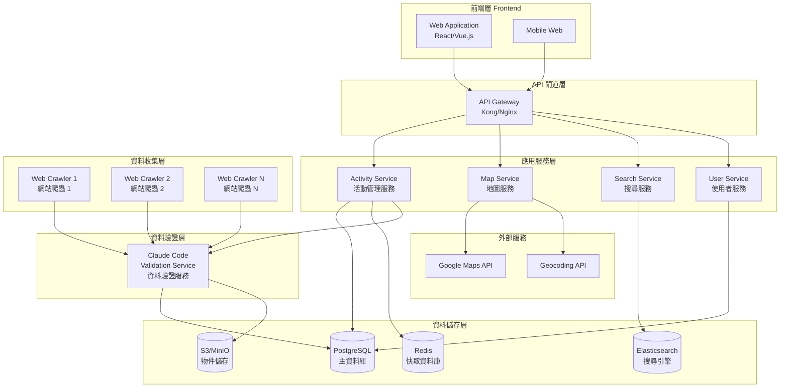
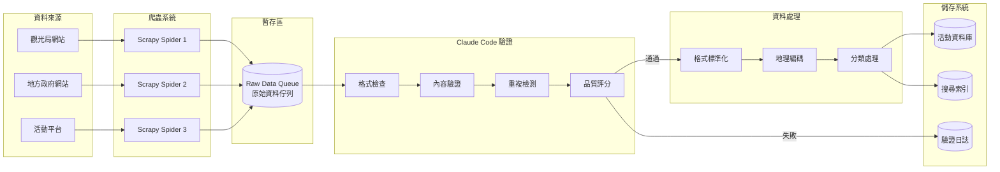
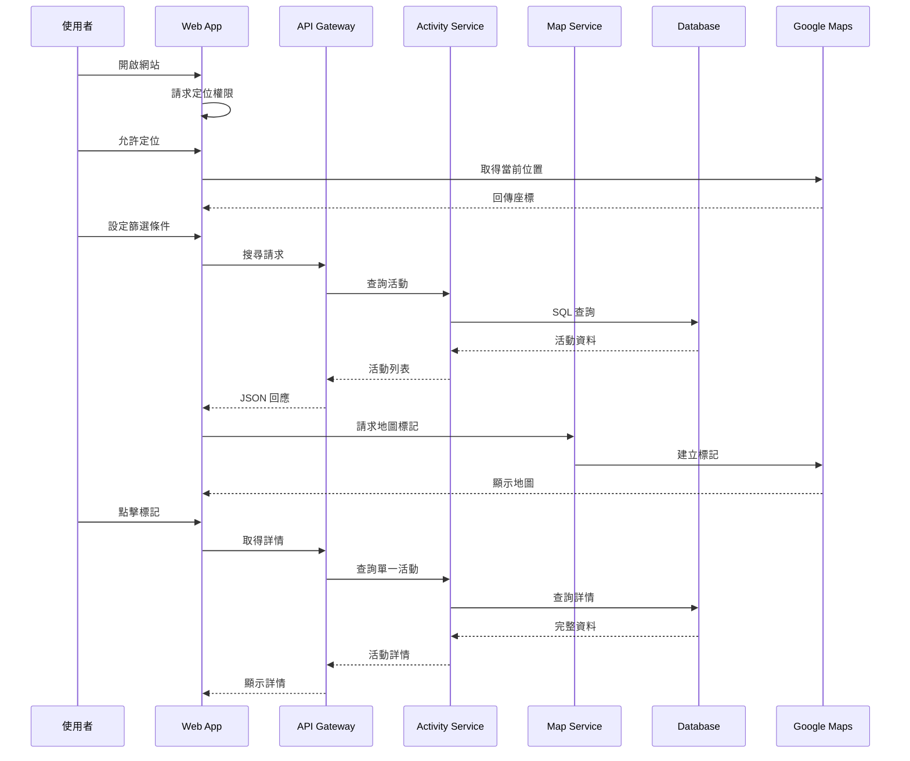
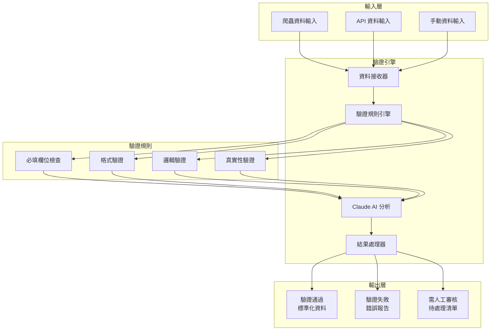
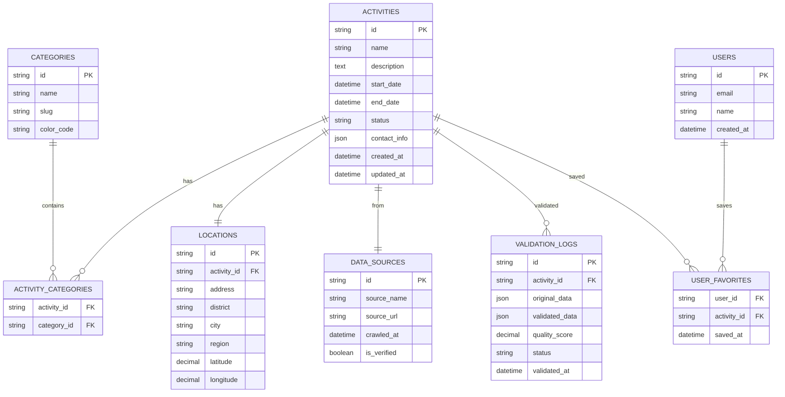
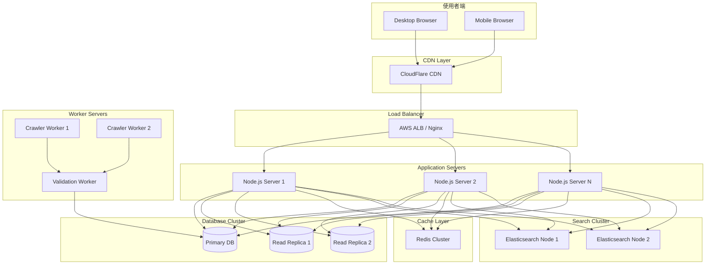
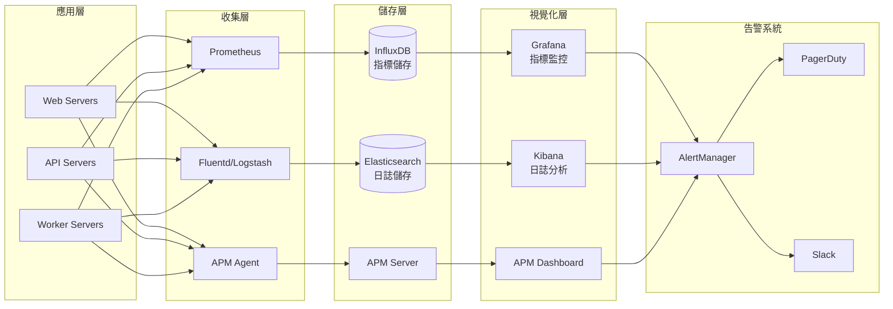

# 觀光活動地圖系統架構圖

## 1. 整體系統架構

## 2. 資料處理流程圖

## 3. 使用者互動流程圖

## 4. Claude Code 驗證服務架構

## 5. 資料庫架構圖

## 6. 部署架構圖

## 7. 監控與日誌架構

這些架構圖涵蓋了整個系統的各個層面，從整體架構到具體的資料流程、使用者互動、資料庫設計和部署方案。每個圖表都使用 Mermaid 語法，可以在支援 Markdown 的環境中直接渲染顯示。