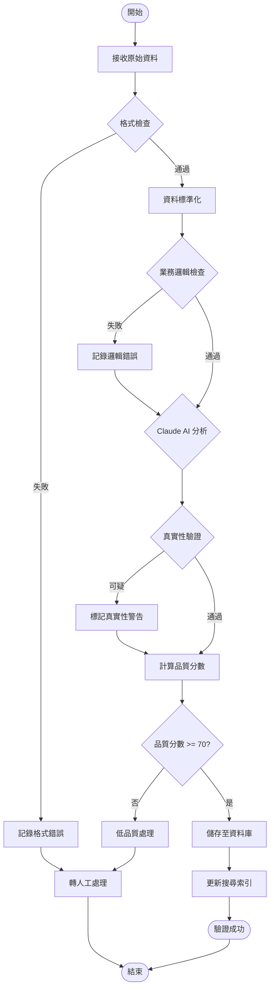

# 資料標準格式與驗證流程文件

## 1. 資料標準格式定義

### 1.1 完整資料模型

```typescript
interface TourismActivity {
  // 基本資訊
  id: string;                    // 唯一識別碼 (UUID)
  name: string;                  // 活動名稱
  description?: string;          // 活動描述
  summary?: string;              // 活動摘要（50字以內）
  
  // 地點資訊
  location: {
    address: string;             // 完整地址
    district?: string;           // 行政區（例：信義區）
    city: string;                // 縣市（例：台北市）
    region: Region;              // 地區分類
    coordinates?: {              // GPS 座標
      lat: number;               // 緯度
      lng: number;               // 經度
    };
    venue?: string;              // 場地名稱（例：國父紀念館）
    landmarks?: string[];        // 附近地標
  };
  
  // 時間資訊
  time: {
    start_date: string;          // 開始日期 (YYYY-MM-DD)
    end_date?: string;           // 結束日期 (YYYY-MM-DD)
    start_time?: string;         // 開始時間 (HH:mm)
    end_time?: string;           // 結束時間 (HH:mm)
    duration?: number;           // 持續時間（分鐘）
    recurring?: {                // 重複活動設定
      type: 'daily' | 'weekly' | 'monthly' | 'yearly';
      interval?: number;         // 間隔
      daysOfWeek?: number[];     // 星期幾 (0-6)
      endDate?: string;          // 重複結束日期
    };
    timezone: string;            // 時區 (預設: Asia/Taipei)
  };
  
  // 分類資訊
  category: ActivityCategory[];  // 活動類別（可多選）
  tags?: string[];              // 標籤
  
  // 聯絡資訊
  contact?: {
    phone?: string;             // 聯絡電話
    email?: string;             // 電子郵件
    website?: string;           // 官方網站
    facebook?: string;          // Facebook 頁面
    line?: string;              // LINE 官方帳號
  };
  
  // 參與資訊
  participation?: {
    fee?: {                     // 費用資訊
      amount: number;           // 金額
      currency: string;         // 幣別 (預設: TWD)
      description?: string;     // 費用說明
    };
    registration?: {            // 報名資訊
      required: boolean;        // 是否需要報名
      url?: string;             // 報名網址
      deadline?: string;        // 報名截止日期
      limit?: number;           // 人數限制
    };
    ageLimit?: {               // 年齡限制
      min?: number;
      max?: number;
    };
  };
  
  // 多媒體資源
  media?: {
    images?: {                  // 圖片
      url: string;
      alt?: string;             // 替代文字
      caption?: string;         // 圖片說明
      type: 'cover' | 'gallery';
    }[];
    videos?: {                  // 影片
      url: string;
      platform?: 'youtube' | 'vimeo' | 'other';
      thumbnail?: string;
    }[];
  };
  
  // 資料來源與狀態
  source: {
    website: string;            // 來源網站
    url?: string;               // 原始網址
    crawled_at: string;         // 爬取時間 (ISO 8601)
    crawler_version?: string;   // 爬蟲版本
  };
  
  // 驗證資訊
  validation: {
    verified: boolean;          // 是否已驗證
    verification_date?: string; // 驗證日期
    quality_score?: number;     // 品質分數 (0-100)
    validator?: string;         // 驗證者（系統/人工）
    issues?: ValidationIssue[]; // 驗證問題
  };
  
  // 系統資訊
  status: ActivityStatus;       // 活動狀態
  created_at: string;           // 建立時間
  updated_at: string;           // 更新時間
  version: number;              // 資料版本
}

// 枚舉定義
enum Region {
  NORTH = '北部地區',
  CENTRAL = '中部地區',
  SOUTH = '南部地區',
  EAST = '東部地區',
  ISLAND = '離島地區'
}

enum ActivityCategory {
  TRADITIONAL = '傳統節慶',
  ROMANTIC = '浪漫之旅',
  ART_CULTURE = '藝術文化',
  WELLNESS = '養生樂活',
  CUISINE = '美食饗宴',
  NATURE = '自然生態',
  INDIGENOUS = '原民慶典',
  HAKKA = '客家文化'
}

enum ActivityStatus {
  ACTIVE = 'active',           // 進行中
  UPCOMING = 'upcoming',       // 即將開始
  ENDED = 'ended',            // 已結束
  CANCELLED = 'cancelled',    // 已取消
  PENDING = 'pending',        // 待審核
  DRAFT = 'draft'             // 草稿
}

interface ValidationIssue {
  field: string;               // 問題欄位
  type: string;                // 問題類型
  severity: 'error' | 'warning' | 'info';
  message: string;             // 問題描述
  suggestion?: string;         // 建議修正
}
```

## 2. 資料驗證規則

### 2.1 欄位層級驗證

```javascript
const validationRules = {
  // 必填欄位
  required: [
    'name',
    'location.address',
    'location.city',
    'location.region',
    'time.start_date',
    'category',
    'source.website'
  ],
  
  // 格式驗證
  formats: {
    'id': /^[0-9a-f]{8}-[0-9a-f]{4}-4[0-9a-f]{3}-[89ab][0-9a-f]{3}-[0-9a-f]{12}$/i,
    'time.start_date': /^\d{4}-\d{2}-\d{2}$/,
    'time.end_date': /^\d{4}-\d{2}-\d{2}$/,
    'time.start_time': /^([01]\d|2[0-3]):([0-5]\d)$/,
    'time.end_time': /^([01]\d|2[0-3]):([0-5]\d)$/,
    'contact.phone': /^(\+886-?)?0?\d{1,2}-?\d{3,4}-?\d{4}$/,
    'contact.email': /^[^\s@]+@[^\s@]+\.[^\s@]+$/,
    'contact.website': /^https?:\/\/.+$/
  },
  
  // 值域驗證
  ranges: {
    'location.coordinates.lat': { min: -90, max: 90 },
    'location.coordinates.lng': { min: -180, max: 180 },
    'participation.fee.amount': { min: 0 },
    'participation.ageLimit.min': { min: 0, max: 120 },
    'participation.ageLimit.max': { min: 0, max: 120 },
    'validation.quality_score': { min: 0, max: 100 }
  },
  
  // 長度限制
  lengths: {
    'name': { min: 2, max: 100 },
    'summary': { max: 50 },
    'description': { max: 5000 },
    'location.address': { min: 5, max: 200 }
  }
};
```

### 2.2 業務邏輯驗證

```javascript
const businessValidation = {
  // 時間邏輯檢查
  timeValidation: (activity) => {
    const errors = [];
    
    // 結束日期不能早於開始日期
    if (activity.time.end_date && 
        new Date(activity.time.end_date) < new Date(activity.time.start_date)) {
      errors.push({
        field: 'time.end_date',
        type: 'logic_error',
        severity: 'error',
        message: '結束日期不能早於開始日期'
      });
    }
    
    // 活動不能超過 365 天
    if (activity.time.end_date) {
      const duration = (new Date(activity.time.end_date) - new Date(activity.time.start_date)) 
                      / (1000 * 60 * 60 * 24);
      if (duration > 365) {
        errors.push({
          field: 'time',
          type: 'duration_error',
          severity: 'warning',
          message: '活動持續時間超過一年，請確認是否正確'
        });
      }
    }
    
    return errors;
  },
  
  // 地址驗證
  addressValidation: (activity) => {
    const errors = [];
    const taiwanCities = [
      '台北市', '新北市', '桃園市', '台中市', '台南市', '高雄市',
      '基隆市', '新竹市', '嘉義市', '新竹縣', '苗栗縣', '彰化縣',
      '南投縣', '雲林縣', '嘉義縣', '屏東縣', '宜蘭縣', '花蓮縣',
      '台東縣', '澎湖縣', '金門縣', '連江縣'
    ];
    
    if (!taiwanCities.includes(activity.location.city)) {
      errors.push({
        field: 'location.city',
        type: 'invalid_city',
        severity: 'error',
        message: '無效的縣市名稱',
        suggestion: `請使用以下縣市名稱之一：${taiwanCities.join('、')}`
      });
    }
    
    // 檢查地址是否包含縣市名稱
    if (!activity.location.address.includes(activity.location.city)) {
      errors.push({
        field: 'location.address',
        type: 'address_city_mismatch',
        severity: 'warning',
        message: '地址中未包含所選縣市名稱'
      });
    }
    
    return errors;
  },
  
  // 類別驗證
  categoryValidation: (activity) => {
    const errors = [];
    const validCategories = Object.values(ActivityCategory);
    
    for (const category of activity.category) {
      if (!validCategories.includes(category)) {
        errors.push({
          field: 'category',
          type: 'invalid_category',
          severity: 'error',
          message: `無效的活動類別：${category}`,
          suggestion: `請使用以下類別之一：${validCategories.join('、')}`
        });
      }
    }
    
    return errors;
  }
};
```

## 3. Claude Code 驗證整合流程

### 3.1 驗證服務介面

```typescript
interface ClaudeValidationService {
  // 主要驗證方法
  validateActivity(rawData: any): Promise<ValidationResult>;
  
  // 批次驗證
  validateBatch(activities: any[]): Promise<ValidationResult[]>;
  
  // 智慧修正建議
  suggestCorrections(activity: any, issues: ValidationIssue[]): Promise<CorrectionSuggestion[]>;
  
  // 真實性驗證
  verifyAuthenticity(activity: TourismActivity): Promise<AuthenticityResult>;
}

interface ValidationResult {
  id: string;
  original_data: any;
  validated_data?: TourismActivity;
  is_valid: boolean;
  quality_score: number;
  issues: ValidationIssue[];
  suggestions: CorrectionSuggestion[];
  timestamp: string;
}

interface CorrectionSuggestion {
  field: string;
  original_value: any;
  suggested_value: any;
  confidence: number;
  reason: string;
}

interface AuthenticityResult {
  is_authentic: boolean;
  confidence: number;
  evidence: {
    source: string;
    description: string;
    reliability: number;
  }[];
  concerns: string[];
}
```

### 3.2 驗證流程實作

```javascript
class ActivityValidator {
  constructor(claudeService) {
    this.claudeService = claudeService;
  }
  
  async validateActivity(rawData) {
    const result = {
      id: generateUUID(),
      original_data: rawData,
      issues: [],
      suggestions: [],
      timestamp: new Date().toISOString()
    };
    
    try {
      // Step 1: 基本格式驗證
      const formatIssues = this.validateFormat(rawData);
      result.issues.push(...formatIssues);
      
      // Step 2: 資料標準化
      const standardizedData = this.standardizeData(rawData);
      
      // Step 3: 業務邏輯驗證
      const logicIssues = this.validateBusinessLogic(standardizedData);
      result.issues.push(...logicIssues);
      
      // Step 4: Claude AI 深度驗證
      if (result.issues.filter(i => i.severity === 'error').length === 0) {
        const claudeValidation = await this.claudeService.validateActivity(standardizedData);
        result.issues.push(...claudeValidation.issues);
        result.suggestions.push(...claudeValidation.suggestions);
        
        // Step 5: 真實性驗證
        const authenticityCheck = await this.claudeService.verifyAuthenticity(standardizedData);
        if (!authenticityCheck.is_authentic) {
          result.issues.push({
            field: 'general',
            type: 'authenticity',
            severity: 'warning',
            message: '活動真實性存疑',
            suggestion: authenticityCheck.concerns.join('; ')
          });
        }
      }
      
      // Step 6: 計算品質分數
      result.quality_score = this.calculateQualityScore(standardizedData, result.issues);
      
      // Step 7: 決定驗證結果
      result.is_valid = result.issues.filter(i => i.severity === 'error').length === 0;
      if (result.is_valid) {
        result.validated_data = standardizedData;
      }
      
    } catch (error) {
      result.issues.push({
        field: 'general',
        type: 'system_error',
        severity: 'error',
        message: `驗證過程發生錯誤：${error.message}`
      });
      result.is_valid = false;
    }
    
    return result;
  }
  
  standardizeData(rawData) {
    // 資料標準化邏輯
    const standardized = {
      id: rawData.id || generateUUID(),
      name: this.cleanText(rawData.name || rawData.title),
      description: this.cleanText(rawData.description || rawData.content),
      location: this.standardizeLocation(rawData),
      time: this.standardizeTime(rawData),
      category: this.standardizeCategories(rawData),
      contact: this.standardizeContact(rawData),
      source: {
        website: rawData.source_website,
        url: rawData.source_url,
        crawled_at: rawData.crawled_at || new Date().toISOString()
      },
      validation: {
        verified: false,
        quality_score: 0
      },
      status: this.determineStatus(rawData),
      created_at: new Date().toISOString(),
      updated_at: new Date().toISOString(),
      version: 1
    };
    
    return standardized;
  }
  
  calculateQualityScore(activity, issues) {
    let score = 100;
    
    // 扣分項目
    issues.forEach(issue => {
      switch (issue.severity) {
        case 'error': score -= 20; break;
        case 'warning': score -= 10; break;
        case 'info': score -= 5; break;
      }
    });
    
    // 資料完整度加分
    const completeness = this.calculateCompleteness(activity);
    score = score * (0.5 + completeness * 0.5);
    
    return Math.max(0, Math.min(100, Math.round(score)));
  }
}
```

## 4. 驗證流程圖



## 5. 驗證報告範例

```json
{
  "validation_report": {
    "report_id": "val_20250120_001",
    "activity_name": "2025 台灣燈會",
    "validation_time": "2025-01-20T14:30:00Z",
    "overall_result": "PASSED_WITH_WARNINGS",
    "quality_score": 85,
    
    "summary": {
      "total_fields": 25,
      "validated_fields": 23,
      "errors": 0,
      "warnings": 2,
      "info": 3
    },
    
    "issues": [
      {
        "field": "location.coordinates",
        "type": "missing_data",
        "severity": "warning",
        "message": "缺少 GPS 座標資訊",
        "suggestion": "建議使用地理編碼服務取得座標"
      },
      {
        "field": "participation.registration.limit",
        "type": "missing_data",
        "severity": "info",
        "message": "未提供參與人數限制資訊"
      }
    ],
    
    "authenticity_check": {
      "result": "VERIFIED",
      "confidence": 0.92,
      "evidence": [
        {
          "source": "官方網站交叉驗證",
          "match": true
        },
        {
          "source": "歷史資料比對",
          "match": true
        }
      ]
    },
    
    "corrections_applied": [
      {
        "field": "location.city",
        "original": "台北",
        "corrected": "台北市",
        "reason": "標準化縣市名稱"
      }
    ],
    
    "recommendations": [
      "建議補充活動的詳細描述",
      "建議加入活動現場照片",
      "建議提供更詳細的交通資訊"
    ]
  }
}
```

## 6. 錯誤處理與復原機制

### 6.1 常見錯誤類型

1. **資料格式錯誤**
   - JSON 解析失敗
   - 必要欄位缺失
   - 資料類型不符

2. **驗證邏輯錯誤**
   - 時間邏輯衝突
   - 地理位置無效
   - 類別不存在

3. **系統錯誤**
   - Claude API 逾時
   - 資料庫連線失敗
   - 記憶體不足

### 6.2 復原策略

```javascript
const errorRecoveryStrategies = {
  // 重試機制
  retry: {
    maxAttempts: 3,
    backoffMultiplier: 2,
    initialDelay: 1000
  },
  
  // 降級處理
  fallback: {
    useBasicValidation: true,
    skipAIValidation: false,
    acceptLowerQuality: true
  },
  
  // 錯誤通知
  notification: {
    channels: ['email', 'slack'],
    threshold: 10, // 錯誤次數閾值
    interval: 3600000 // 1 小時
  }
};
```

## 7. 效能優化建議

1. **批次處理**
   - 每批 100 筆資料
   - 並行處理多批次
   - 使用佇列管理

2. **快取策略**
   - 驗證規則快取
   - 地理編碼結果快取
   - Claude 回應快取

3. **資源管理**
   - 連線池管理
   - 記憶體使用監控
   - CPU 使用率控制

這份文件提供了完整的資料標準格式定義和驗證流程，確保從各個來源收集的觀光活動資料都能轉換成統一、高品質的格式。